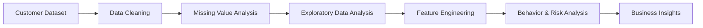
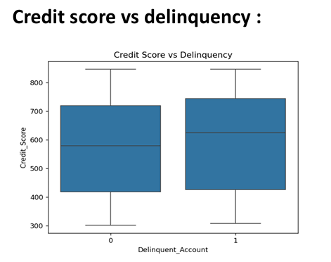
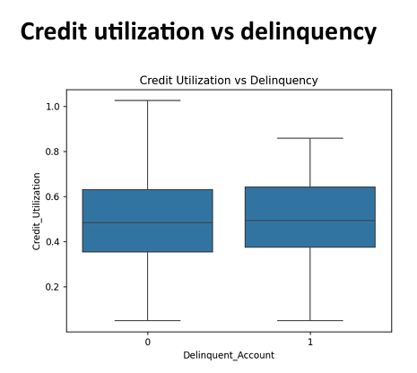
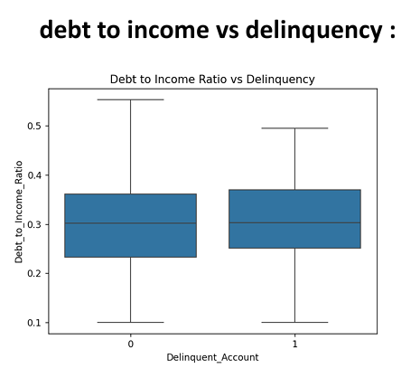
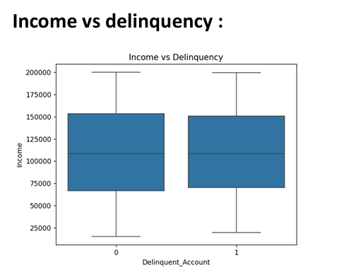
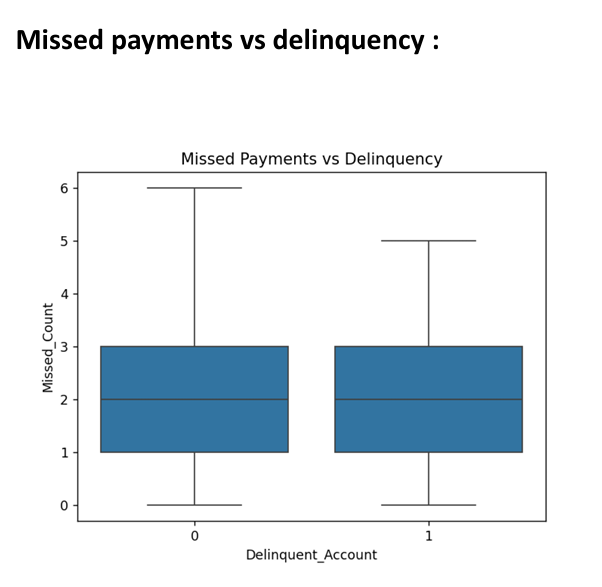
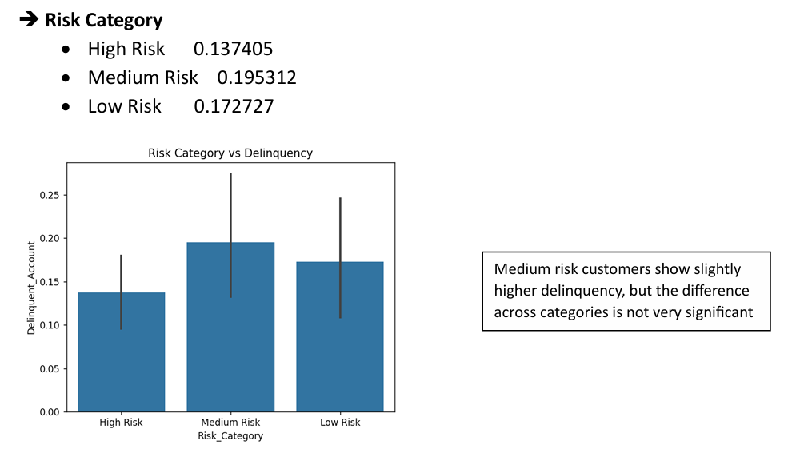

# Customer Delinquency Analysis

An Exploratory Data Analysis (EDA) project focused on identifying customer delinquency patterns and financial risk indicators using Python.

This project was completed as part of the **Tata iQ GenAI Powered Data Analytics Job Simulation** on **Forage**, where the objective was to analyze customer financial data and derive business insights to support delinquency risk prediction.

---

## Project Overview

Customer delinquency is a major challenge for financial institutions. This project explores customer demographics, credit behavior, loan information, and repayment history to identify factors associated with delinquency.

The analysis focuses on understanding customer behavior, handling missing data, engineering useful features, and generating insights that can support future predictive models for credit risk assessment.

---

## Dataset

**Source:** Tata iQ – GenAI Powered Data Analytics Job Simulation (Forage)

The dataset contains **501 customer records** with financial and behavioral information, including:

- Customer ID
- Age
- Income
- Credit Score
- Credit Utilization
- Missed Payments
- Delinquent Account
- Loan Balance
- Debt-to-Income Ratio
- Employment Status
- Credit Tenure
- Credit Card Usage
- Monthly Payment History

**Note:** The dataset is provided for educational purposes as part of the Tata iQ virtual job simulation.

---

## Technologies

- Python
- Pandas
- NumPy
- Matplotlib
- Seaborn
- OpenPyXL

---

## Workflow



---

## Sample Visualizations

> Add your screenshots inside an **images/** folder and update the paths below.

### Credit Score vs Delinquency



---

### Credit Utilization vs Delinquency



---

### Debt-to-Income Ratio vs Delinquency



---

### Income Distribution by Delinquency Status



---

### Missed Payments vs Delinquency



---

### Customer Risk Category Distribution



---

## Key Insights

- Customer delinquency is influenced by multiple financial factors rather than a single feature.
- High credit utilization and repeated missed payments are strong indicators of delinquency risk.
- Customers with higher debt-to-income ratios generally exhibit greater repayment risk.
- Missing values were identified and appropriately handled before performing the analysis.
- Significant overlap exists between delinquent and non-delinquent customers, highlighting the need for predictive modeling rather than simple rule-based decisions.

---

## Repository Structure

```text
Customer-Delinquency-Analysis/
│
├── images/
├── Delinquency_analysis.py
├── Customer_prediction_dataset.xlsx
├── EDA_Report.pdf
├── requirements.txt
└── README.md
```

---

## How to Run

### 1. Clone the repository

```bash
git clone https://github.com/yourusername/customer-delinquency-analysis.git
```

### 2. Navigate to the project folder

```bash
cd customer-delinquency-analysis
```

### 3. Install dependencies

```bash
pip install -r requirements.txt
```

### 4. Run the analysis

```bash
python customer_delinquency_analysis.py
```

---

## Future Improvements

- Build a predictive machine learning model for delinquency prediction.
- Compare Logistic Regression, Decision Tree, and Random Forest models.
- Deploy an interactive dashboard using Streamlit.
- Add model evaluation metrics and explainability techniques.
- Expand the analysis using larger real-world financial datasets.

---

## Author

B.Tech Computer Science Engineering

Interested in Data Analytics, Machine Learning, and AI.

---

## Acknowledgements

- **Tata iQ** for designing the GenAI Powered Data Analytics Job Simulation.
- **Forage** for providing the virtual job simulation platform and learning experience.
